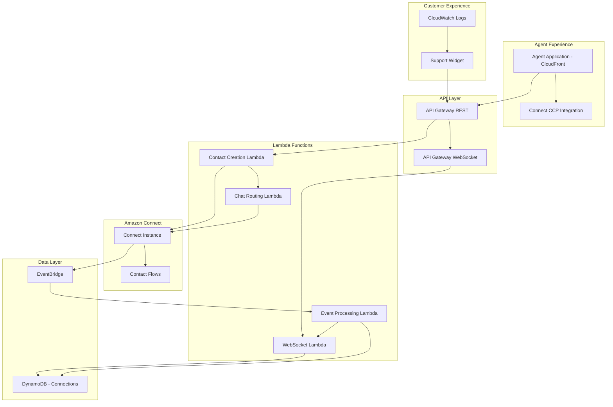
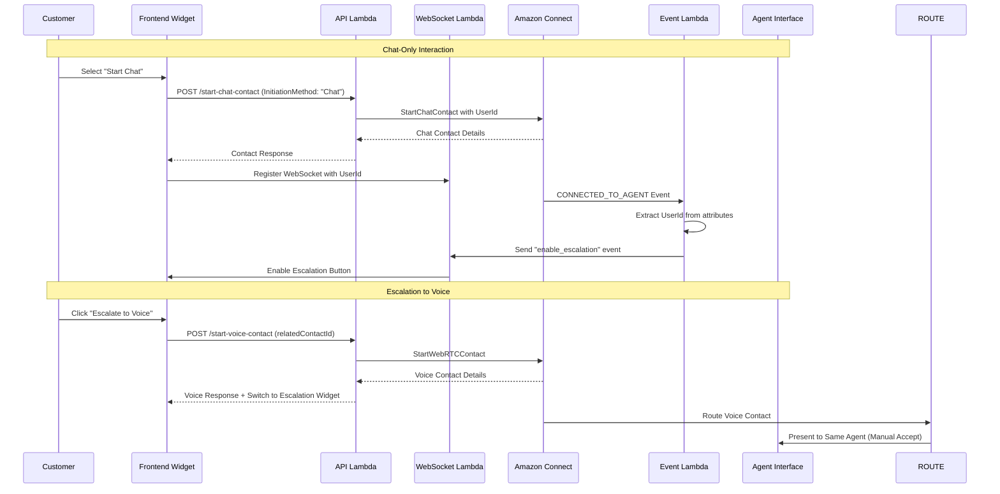

# Comprehensive System Design Document
## Amazon Connect Multi-Modal Customer Interaction Platform

## Overview

This comprehensive design document consolidates the architecture and implementation details from all individual feature specifications to provide a complete view of the Amazon Connect Multi-Modal Customer Interaction Platform. The system has evolved from a simple demo to a production-ready customer support platform that supports multiple interaction modes: chat-only, voice+chat, and chat-to-voice escalation.

The platform consists of:
- **Professional Customer Website**: Hyundai-inspired automotive website with integrated support widget
- **Agent Application**: Dedicated interface for contact center operations
- **Backend Infrastructure**: AWS-based services for contact management and routing
- **Multi-Modal Support**: Seamless transitions between chat and voice interactions

## System Architecture

### High-Level Architecture



### Component Interaction Flow



## Components and Interfaces

### 1. Customer Website (Frontend)

#### Professional Website Structure
- **Technology Stack**: HTML5, CSS3, Vanilla JavaScript, Vite build system
- **Design**: Hyundai-inspired automotive website with professional styling
- **Hosting**: AWS CloudFront + S3 static website hosting
- **Responsive Design**: Mobile and desktop optimized

#### Support Widget Integration
```javascript
// Widget State Management
const WidgetState = {
  mode: null, // 'chat-only' | 'voice-chat' | 'escalated'
  userId: null, // Generated on app load
  chatContactId: null,
  voiceContactId: null,
  websocketConnection: null,
  escalationEnabled: false
};

// Widget Initialization
class SupportWidget {
  constructor() {
    this.userId = this.generateUserId();
    this.initializeWebSocket();
    this.setupEventHandlers();
  }
  
  generateUserId() {
    return 'user_' + crypto.randomUUID();
  }
  
  async startChatOnly() {
    const response = await this.callAPI('/start-chat-contact', {
      userId: this.userId,
      initiationMethod: 'Chat'
    });
    
    this.mode = 'chat-only';
    this.chatContactId = response.contactId;
    this.initializeChatWidget(response);
  }
  
  async escalateToVoice() {
    const response = await this.callAPI('/start-voice-contact', {
      userId: this.userId,
      relatedContactId: this.chatContactId,
      initiationMethod: 'Chat'
    });
    
    this.mode = 'escalated';
    this.voiceContactId = response.contactId;
    this.switchToEscalationWidget(response);
  }
}
```

#### Widget Types

**Chat Widget**: Handles chat-only interactions
- Text messaging interface
- Typing indicators
- Message history
- Escalation button (when enabled)

**Voice Widget**: Handles voice+chat interactions (unchanged from original)
- WebRTC voice connection
- Chat interface
- Combined interaction management

**Escalation Widget**: Handles escalated chat-to-voice interactions
- Preserves chat history
- Adds voice capabilities
- "Continue in Chat" option
- Dual-mode interface

### 2. Agent Application

#### Dedicated Agent Interface
```javascript
// Agent Application Structure
class AgentApplication {
  constructor() {
    this.ccpContainer = document.getElementById('ccp-container');
    this.initializeCCP();
    this.setupAutoAcceptLogic();
  }
  
  initializeCCP() {
    connect.core.initCCP(this.ccpContainer, {
      ccpUrl: CONFIG.connect.ccpUrl,
      loginPopup: true,
      softphone: {
        allowFramedSoftphone: true
      }
    });
  }
  
  setupAutoAcceptLogic() {
    connect.contact((contact) => {
      if (this.shouldAutoAccept(contact)) {
        contact.accept();
      }
    });
  }
  
  shouldAutoAccept(contact) {
    // Auto-accept chat contacts related to active voice contacts
    const attributes = contact.getAttributes();
    return attributes.relatedContactId && 
           contact.getType() === connect.ContactType.CHAT;
  }
}
```

### 3. Backend Lambda Functions

#### API Lambda (Contact Creation)
```javascript
// Enhanced API Lambda with multi-modal support
exports.handler = async (event) => {
  const { path, body } = event;
  const requestData = JSON.parse(body);
  
  try {
    switch (path) {
      case '/start-chat-contact':
        return await handleStartChat(requestData);
      case '/start-voice-contact':
        return await handleStartVoice(requestData);
      default:
        return createResponse(404, { error: 'Not found' });
    }
  } catch (error) {
    return handleError(error);
  }
};

async function handleStartChat(data) {
  const params = {
    InstanceId: CONNECT_INSTANCE_ID,
    ContactFlowId: CONTACT_FLOW_ID,
    ParticipantDetails: {
      DisplayName: data.customerName || 'Customer'
    },
    Attributes: {
      userId: data.userId,
      InitiationMethod: data.initiationMethod || 'Chat'
    }
  };
  
  const result = await connect.startChatContact(params).promise();
  return createResponse(200, {
    contactId: result.ContactId,
    participantId: result.ParticipantId,
    participantToken: result.ParticipantToken
  });
}

async function handleStartVoice(data) {
  const params = {
    InstanceId: CONNECT_INSTANCE_ID,
    ContactFlowId: CONTACT_FLOW_ID,
    ParticipantDetails: {
      DisplayName: data.customerName || 'Customer'
    },
    Attributes: {
      userId: data.userId,
      InitiationMethod: data.initiationMethod || 'Voice',
      ...(data.relatedContactId && { relatedContactId: data.relatedContactId })
    }
  };
  
  const result = await connect.startWebRTCContact(params).promise();
  return createResponse(200, {
    contactId: result.ContactId,
    participantId: result.ParticipantId,
    participantToken: result.ParticipantToken,
    connectionData: result.ConnectionData
  });
}
```

#### WebSocket Lambda (Connection Management)
```javascript
// UserId-based WebSocket management
exports.handler = async (event) => {
  const { eventType, connectionId } = event.requestContext;
  
  switch (eventType) {
    case 'CONNECT':
      return await handleConnect(connectionId);
    case 'DISCONNECT':
      return await handleDisconnect(connectionId);
    case 'MESSAGE':
      return await handleMessage(event);
    default:
      return { statusCode: 400 };
  }
};

async function handleMessage(event) {
  const { connectionId } = event.requestContext;
  const message = JSON.parse(event.body);
  
  if (message.action === 'register') {
    await registerConnection(connectionId, message.userId);
    return { statusCode: 200 };
  }
  
  return { statusCode: 400 };
}

async function registerConnection(connectionId, userId) {
  const params = {
    TableName: CONNECTIONS_TABLE,
    Item: {
      connectionId,
      userId,
      connectedAt: Date.now(),
      ttl: Math.floor(Date.now() / 1000) + 86400 // 24 hours
    }
  };
  
  await dynamodb.put(params).promise();
}
```

#### Event Processing Lambda
```javascript
// Contact event processing with UserId extraction
exports.handler = async (event) => {
  for (const record of event.Records) {
    const contactEvent = JSON.parse(record.body);
    await processContactEvent(contactEvent);
  }
};

async function processContactEvent(event) {
  const { eventType, contactId } = event.detail;
  
  if (eventType === 'CONNECTED_TO_AGENT') {
    const userId = await extractUserIdFromContact(contactId);
    
    if (userId) {
      const connection = await findConnectionByUserId(userId);
      
      if (connection) {
        const initiationMethod = await getInitiationMethod(contactId);
        
        if (initiationMethod === 'Chat') {
          await sendEscalationEvent(connection.connectionId, contactId, userId);
        }
      }
    }
  }
}

async function extractUserIdFromContact(contactId) {
  const params = {
    InstanceId: CONNECT_INSTANCE_ID,
    ContactId: contactId
  };
  
  const result = await connect.describeContact(params).promise();
  return result.Contact.Attributes.userId;
}

async function findConnectionByUserId(userId) {
  const params = {
    TableName: CONNECTIONS_TABLE,
    IndexName: 'userIdIndex',
    KeyConditionExpression: 'userId = :userId',
    ExpressionAttributeValues: {
      ':userId': userId
    }
  };
  
  const result = await dynamodb.query(params).promise();
  return result.Items[0];
}
```

#### Chat Routing Lambda
```javascript
// Enhanced routing for escalated contacts
exports.handler = async (event) => {
  const contact = event.detail;
  
  // Check if this is an escalated contact
  if (contact.attributes.relatedContactId) {
    return await routeEscalatedContact(contact);
  }
  
  // Standard routing for non-escalated contacts
  return await standardRouting(contact);
};

async function routeEscalatedContact(contact) {
  try {
    const chatAgent = await getAgentForContact(contact.attributes.relatedContactId);
    
    if (chatAgent) {
      return await routeToSpecificAgent(contact, chatAgent, { 
        autoAccept: false,
        escalated: true 
      });
    }
  } catch (error) {
    console.error('Escalated routing failed:', error);
  }
  
  // Fallback to standard routing
  return await standardRouting(contact);
}
```

## Data Models

### Contact Attributes Schema
```javascript
{
  userId: "user_abc123",                    // Required for all contacts
  InitiationMethod: "Chat" | "Voice",      // Contact initiation type
  relatedContactId: "contact-xyz789",      // For escalated contacts
  interactionMode: "chat-only" | "voice-chat" | "escalated"
}
```

### WebSocket Connection Schema
```javascript
{
  connectionId: "abc123",          // Primary key
  userId: "user_xyz789",          // GSI key for UserId-based lookup
  interactionMode: "chat-only",   // Current interaction mode
  connectedAt: 1640995200000,     // Connection timestamp
  registeredAt: 1640995201000,    // Registration timestamp
  ttl: 1641081600                 // TTL for automatic cleanup
}
```

### Widget State Models
```javascript
// Chat Widget State
{
  contactId: "chat-contact-id",
  userId: "user_abc123",
  interactionMode: "chat-only",
  escalationEnabled: false,
  session: ChatSession,
  messages: Array<Message>
}

// Escalation Widget State
{
  chatContactId: "chat-id",
  voiceContactId: "voice-id", 
  userId: "user_abc123",
  chatSession: ChatSession,
  voiceSession: VoiceSession,
  mode: "escalated",
  canDeEscalate: true
}
```

## Correctness Properties

*A property is a characteristic or behavior that should hold true across all valid executions of a system-essentially, a formal statement about what the system should do. Properties serve as the bridge between human-readable specifications and machine-verifiable correctness guarantees.*

### Core System Properties

**Property 1: UserId Consistency Across Interactions**
*For any* user session, all contacts created within that session should use the same UserId, and all WebSocket events should route to the same connection
**Validates: Multi-modal interaction consistency**

**Property 2: InitiationMethod Attribute Correctness**
*For any* contact creation, the InitiationMethod attribute should correctly reflect the interaction type: "Chat" for chat-only and escalated interactions, "Voice" for voice+chat interactions
**Validates: Contact categorization requirements**

**Property 3: Escalation Enablement Logic**
*For any* agent connected event for a chat contact with InitiationMethod "Chat", the system should enable escalation options, and should NOT enable escalation for InitiationMethod "Voice"
**Validates: Conditional escalation availability**

**Property 4: Agent Continuity in Escalation**
*For any* escalated voice contact with a related chat contact, the system should route the voice contact to the same agent handling the chat contact
**Validates: Agent continuity requirements**

**Property 5: Contact Linkage Preservation**
*For any* escalated interaction, the voice contact should maintain a reference to the original chat contact throughout the interaction lifecycle
**Validates: Contact relationship integrity**

**Property 6: Widget State Transitions**
*For any* interaction mode change (chat-only → escalated → chat-only), the system should preserve chat history and maintain consistent UI state
**Validates: User experience continuity**

**Property 7: WebSocket Connection Lookup**
*For any* contact event with a valid UserId, the system should successfully locate the corresponding WebSocket connection using the UserId index
**Validates: Event routing reliability**

**Property 8: Multi-Modal Infrastructure Reuse**
*For any* interaction mode, the system should use the same underlying infrastructure (WebSocket, message routing, security) with mode-specific behavior layered on top
**Validates: Infrastructure consistency**

## Error Handling Strategy

### Frontend Error Handling
```javascript
class ErrorHandler {
  static handleAPIError(error, context) {
    console.error(`API Error in ${context}:`, error);
    
    const userMessage = this.getUserFriendlyMessage(error);
    this.displayError(userMessage);
    
    // Allow retry for recoverable errors
    if (this.isRecoverable(error)) {
      this.showRetryOption(context);
    }
  }
  
  static getUserFriendlyMessage(error) {
    switch (error.code) {
      case 'INVALID_RELATED_CONTACT':
        return 'Unable to escalate. Please try starting a new chat.';
      case 'SERVICE_UNAVAILABLE':
        return 'Service temporarily unavailable. Please try again.';
      default:
        return 'An error occurred. Please try again or contact support.';
    }
  }
}
```

### Backend Error Handling
```javascript
// Graceful degradation patterns
async function processWithFallback(primaryAction, fallbackAction, context) {
  try {
    return await primaryAction();
  } catch (error) {
    console.error(`Primary action failed in ${context}:`, error);
    
    try {
      return await fallbackAction();
    } catch (fallbackError) {
      console.error(`Fallback action failed in ${context}:`, fallbackError);
      throw new Error(`Both primary and fallback actions failed: ${context}`);
    }
  }
}
```

## Testing Strategy

### Comprehensive Testing Approach

The system employs a multi-layered testing strategy:

#### Unit Testing
- Component-level functionality verification
- API endpoint behavior validation
- Error handling scenario testing
- UI state management verification

#### Property-Based Testing
- **Framework**: fast-check library for JavaScript/TypeScript
- **Configuration**: Minimum 100 iterations per property test
- **Coverage**: Universal properties across all valid inputs
- **Tagging**: Each test tagged with feature and property reference

#### Integration Testing
- End-to-end interaction flows
- Cross-component communication
- WebSocket connection lifecycle
- Contact event processing pipeline

#### Performance Testing
- Concurrent user load testing
- WebSocket connection scaling
- Database query performance
- API response time validation

### Test Implementation Requirements

```javascript
// Property-based test example
describe('UserId Consistency', () => {
  it('should maintain same UserId across all interactions in a session', 
    fc.property(
      fc.string({ minLength: 10 }), // Generate random UserId
      fc.array(fc.oneof(fc.constant('chat'), fc.constant('voice')), { minLength: 1, maxLength: 5 }), // Interaction sequence
      async (userId, interactions) => {
        // **Feature: comprehensive-system, Property 1: UserId Consistency Across Interactions**
        
        const session = new TestSession(userId);
        const contactIds = [];
        
        for (const interactionType of interactions) {
          const contactId = await session.createContact(interactionType);
          contactIds.push(contactId);
        }
        
        // Verify all contacts have the same UserId
        for (const contactId of contactIds) {
          const attributes = await getContactAttributes(contactId);
          expect(attributes.userId).toBe(userId);
        }
      }
    )
  );
});
```

## Security Considerations

### Authentication and Authorization
- **Frontend**: No AWS credentials exposed to browser
- **Backend**: IAM roles with least privilege access
- **API Gateway**: CORS configuration restricts origins
- **WebSocket**: Connection validation and cleanup

### Data Protection
- **UserId Generation**: Cryptographically secure random values
- **Contact Attributes**: Validated input to prevent injection
- **Logging**: Sensitive data excluded from logs
- **Encryption**: HTTPS/WSS for all communications

### Access Control
- **Agent Application**: Must be added to Connect approved origins
- **API Endpoints**: Rate limiting and request validation
- **WebSocket Connections**: TTL-based automatic cleanup
- **DynamoDB**: Encrypted at rest and in transit

## Deployment Architecture

### Infrastructure Components

#### CloudFront Distributions
```yaml
Customer Website:
  Origin: S3 bucket (frontend/)
  Caching: Static content optimization
  Security: HTTPS redirect, security headers
  
Agent Application:
  Origin: S3 bucket (agent-app/dist/)
  Caching: Static content optimization
  Security: HTTPS redirect, security headers
  Special: Must be in Connect approved origins
```

#### Lambda Functions
```yaml
Contact Creation Lambda:
  Runtime: Node.js 18.x
  Memory: 256 MB
  Timeout: 30 seconds
  Permissions: Connect API access
  
WebSocket Management Lambda:
  Runtime: Node.js 18.x
  Memory: 128 MB
  Timeout: 30 seconds
  Permissions: API Gateway, DynamoDB
  
Event Processing Lambda:
  Runtime: Node.js 18.x
  Memory: 256 MB
  Timeout: 60 seconds
  Permissions: Connect API, DynamoDB, API Gateway
  
Chat Routing Lambda:
  Runtime: Node.js 18.x
  Memory: 256 MB
  Timeout: 30 seconds
  Permissions: Connect API, DynamoDB
```

#### DynamoDB Tables
```yaml
WebSocket Connections:
  Primary Key: connectionId
  GSI: userIdIndex (userId)
  TTL: Enabled for automatic cleanup
  
Agent Contact Mapping:
  Primary Key: voiceContactId
  Attributes: agentId, queueArn, timestamp
```

### Configuration Management

All system configuration is centralized in `config.json`:
```json
{
  "aws": {
    "region": "us-west-2",
    "connect": {
      "instanceId": "602d4c63-50be-4b56-ac69-6068140d5a61",
      "contactFlowId": "c4f2c8c4-cc37-4d69-b1e0-8a8c5b2e1234"
    }
  },
  "api": {
    "restEndpoint": "https://api-gateway-rest-url",
    "websocketEndpoint": "wss://api-gateway-websocket-url"
  },
  "frontend": {
    "customerDistribution": "https://customer-cloudfront-url",
    "agentDistribution": "https://agent-cloudfront-url"
  }
}
```

## Implementation Status

### Completed Features ✅
- Professional customer website with Hyundai-inspired design
- Support widget with chat and voice capabilities
- Separate agent application with CCP integration
- Chat-only interaction mode
- Chat-to-voice escalation functionality
- UserId-based WebSocket optimization
- Auto-accept logic for related contacts
- Comprehensive error handling
- Production deployment infrastructure

### System Capabilities
- **Multi-Modal Interactions**: Seamless transitions between chat and voice
- **Agent Continuity**: Escalated contacts maintain same agent assignment
- **Professional UI**: Production-ready customer and agent interfaces
- **Scalable Architecture**: AWS-native services with auto-scaling capabilities
- **Robust Error Handling**: Graceful degradation and recovery mechanisms
- **Comprehensive Testing**: Unit, integration, and property-based test coverage

## Monitoring and Observability

### CloudWatch Integration
- Lambda function logs with structured logging
- API Gateway access logs and metrics
- DynamoDB performance metrics
- Custom metrics for business logic

### Debugging Capabilities
- Comprehensive error logging with context
- WebSocket connection tracking
- Contact event processing audit trail
- Agent application debugging interface

This comprehensive design document serves as the authoritative reference for the complete Amazon Connect Multi-Modal Customer Interaction Platform, consolidating all individual feature specifications into a unified system architecture.